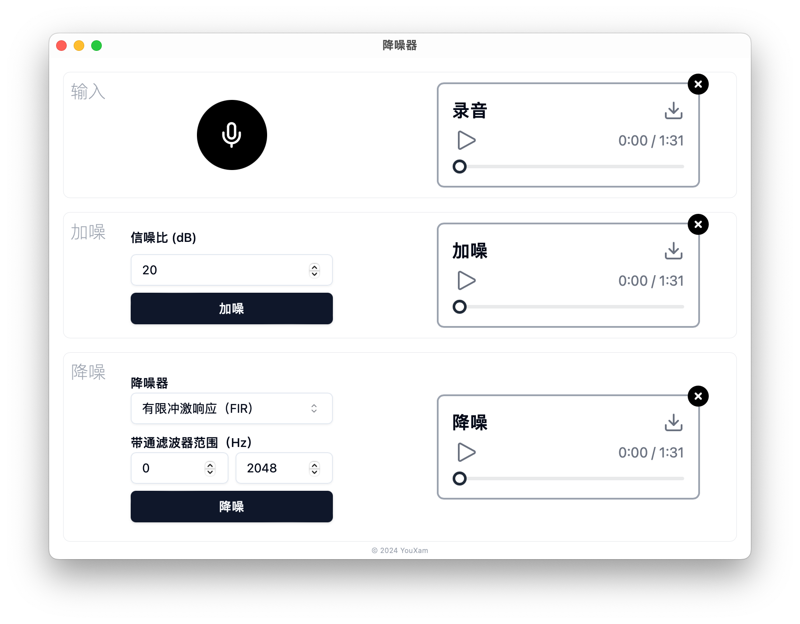

# 降噪器

这是一个简单的降噪器，可以录音、上传音频文件、添加噪声、使用滤波器或者循环神经网络降噪。



## 安装

在 [Releases](https://github.com/YouXam/noise-reducer/releases) 页面下载对应系统和架构的安装包/二进制文件。

> [!IMPORTANT]
> 如果您使用的是 Mac OS X，打开程序时显示 `“noise-reducer.app”已损坏，无法打开`，你需要执行以下命令：
> ```shell
> xattr -d com.apple.quarantine /Applications/noise-reducer.app
> ```

